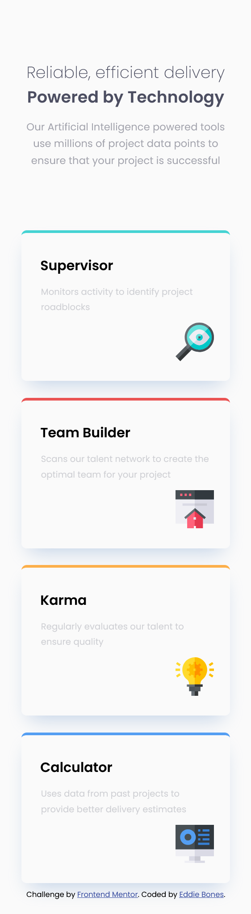

# Frontend Mentor - Four card feature section solution

This is a solution to the [Four card feature section challenge on Frontend Mentor](https://www.frontendmentor.io/challenges/four-card-feature-section-weK1eFYK). Frontend Mentor challenges help you improve your coding skills by building realistic projects.

## Table of contents

- [Overview](#overview)
  - [The challenge](#the-challenge)
  - [Screenshot](#screenshot)
  - [Links](#links)
- [My process](#my-process)
  - [Built with](#built-with)
  - [What I learned](#what-i-learned)
  - [Useful resources](#useful-resources)
- [Author](#author)

## Overview

A nice layout-based challenge for beginners. This will test anyone who is new to multi-column and responsive layouts.

### The challenge

Users should be able to:

- View the optimal layout for the site depending on their device's screen size

### Screenshot

**Desktop Design**

**Mobile Design**

### Links

- [Solution URL](https://www.frontendmentor.io/solutions/four-card-feature-section-evbomMl9vB)
- [Live Site URL](https://eddiebones1.github.io/Four-Card-Feature-Section/)

## My process

### Built with

- Semantic HTML5 markup
- CSS custom properties
- Flexbox
- CSS Grid
- Mobile-first workflow
- SCSS

### What I learned

While working on this project, I found out that `display:flex` is a one dimensional layout, which means that you can layout items in a row or column. Whereas `display:grid` is best for two dimensional layouts, which means that you can layout items in both rows and columns. (`display: flex` can be seen with the mobile design, and `display: grid` can be seen with the desktop design. )

### Useful resources

- [CSS Grid Layout Guide](https://css-tricks.com/snippets/css/complete-guide-grid/) - This comprehensive guide to CSS grid by Chris House helped me better understand `display:grid` and he gave examples as well.

- [CSS Flexbox Layout Guide](https://css-tricks.com/snippets/css/a-guide-to-flexbox/) - This comprehensive guide to CSS grid by Chris Coyler helped me better understand `display:flex` and he gave examples as well.

## Author

- Frontend Mentor - [@EddieBones](https://www.frontendmentor.io/profile/EddieBones1)
- Github - [@EddieBones1](https://github.com/EddieBones1)
